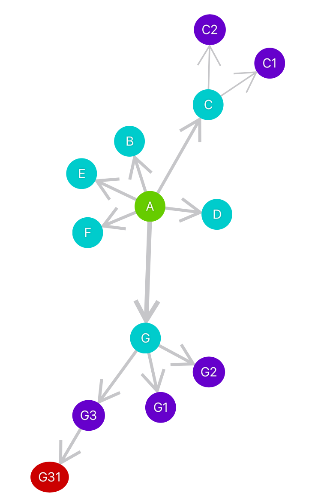

# DirectedGraph

SwiftUI package for displaying directed graphs.

## Installation

In Xcode go to `File -> Swift Packages -> Add Package Dependency…` and paste the repo's url: `https://github.com/nmandica/DirectedGraph`

## Usage

Import the package in the file you would like to use it: `import DirectedGraph`

You can display a graph by adding a `GraphView` to your view.

## Minimum Requirements

| DirectedGraph         | Swift         | Xcode           | Platforms                          |
|------------------------|-------------|----------------|------------------------------|
| DirectedGraph 0.1   | Swift 5.2   | Xcode 11.0   | iOS 13.0 / macOS 10.15  |

## License

DirectedGraph is available under the MIT license. See the LICENSE file for more info.
